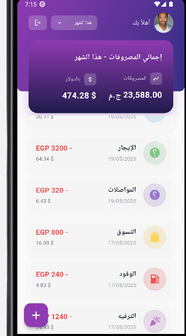

# 💰 مصاريفي - Arabic Expense Tracker App

A beautifully designed Flutter application that helps Arabic-speaking users track their personal expenses in EGP with real-time USD conversion, date-based filtering, and category-based organization.

---

## 📦 Overview of Architecture & Structure

The project follows a **clean architecture without a domain layer** for simplicity:

```
lib/
├── core/                  # Constants, shared widgets, utils, helpers
├── features/
│   ├── auth/              # Authentication logic & UI
│   ├── add_expense/       # Add expense form, model, cubit, repository
│   ├── dashboard/         # Dashboard screen, pagination, summary logic
├── main.dart              # Entry point
├── app.dart               # AppWidget with routing, localization, theming
```

---

## 🎯 State Management

We use `flutter_bloc` for managing state across all modules:

- `AddExpenseCubit` – handles form submission logic
- `DashboardCubit` – manages filtering, initial load, pagination, and refresh

---

## 🔌 API Integration

**Currency exchange rate** is fetched via:

```
GET https://open.er-api.com/v6/latest/EGP
```

- The rate is cached and used when calculating converted USD amount.
- Integration is handled through a `CurrencyApi` class using `dio`.

---

## 🔄 Pagination Strategy

- Pagination is done **locally** via SQLite:
    - `LIMIT` and `OFFSET` are used in queries.
    - Page size is fixed (`_pageSize = 10`)
    - Triggered via `ScrollController` in the `DashboardScreen`.

Example:

```sql
SELECT * FROM expenses
WHERE date BETWEEN :start AND :end
ORDER BY date DESC
LIMIT 10 OFFSET (page - 1) * 10
```

---

## 📷 UI Screenshots

| Dashboard             | Add Expense Form         | Category Picker |
|----------------------|--------------------------|-----------------|
|  |  |  |

---

## ⚖️ Trade-offs / Assumptions

- **No domain layer** used in clean architecture to keep code lightweight.
- **USD conversion** is live but not persisted beyond insert time.
- Currently no user login or multi-user support.
- Categories are static and embedded via dummy data (`Dummy.kDefaultCategories`).

---

## ▶️ How to Run

1. **Clone the repository**

```bash
git clone https://github.com/12ahmed12/masareefi_app.git
cd masareefi_app
```

2. **Install dependencies**

```bash
flutter pub get
```

3. **Run the app**

```bash
flutter run
```

✅ App supports RTL Arabic layout  
✅ Designed for mobile (recommended 360x800 layout)

---

## 🐞 Known Bugs / Missing Features

- Date picker does not persist selected date between sessions.
- Currently, only Android has been tested.
- no icon and splash or logo yet.

---

## 🧠 Author

Developed by **Ahmed Gaber** as part of the Flutter architecture and state management showcase project.

---

## 📄 License

This project is licensed under the MIT License.
